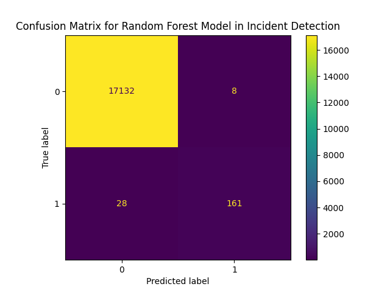
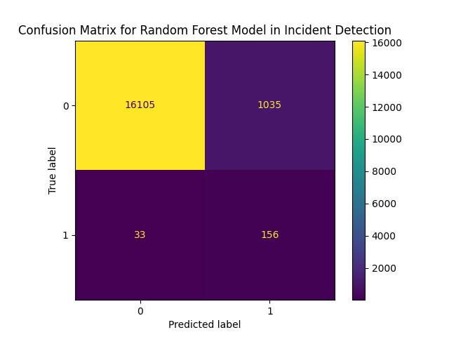
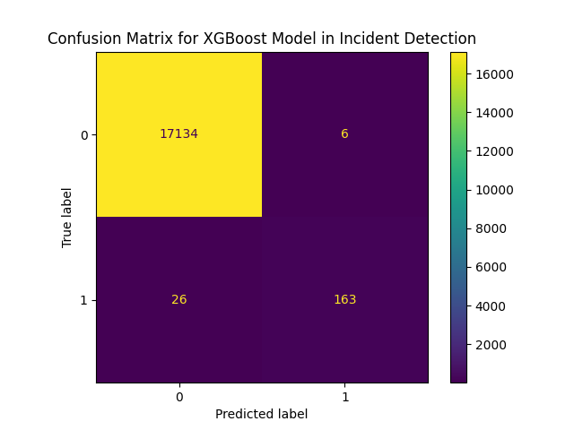

# Predictive Alerting Project

This project focuses on predicting system alerts and incidents using historical time-series data. By leveraging machine learning models, it aims to provide a proactive mechanism for identifying potential failures before they occur.

## Dataset Overview

The project utilizes high-resolution time-series data obtained from https://zenodo.org/records/7541722 and stored in Parquet format within the `dataset/` directory. 
- **Files**: Parquet files containing system metrics.
- **Features**: While the system can process all numerical metrics, performance is compared using a **Full Feature Set** (all numeric columns) and a **Reduced Feature Set** (five power/temperature indicators).
- **Target Variable**: The model predicts the occurrence of an incident.

## Modeling Choices

Random Forest and XGBoost were selected for this task for the following reasons:

1.  **Random Forest Classifier**:
    - **Rationale**: This model was chosen because it is an ensemble of decision trees that reduces overfitting and handles high-dimensional data effectively. It performs well on noisy and imbalanced datasets, which is important for detecting rare incidents.
    - **Configuration**: `300 estimators`, `class_weight='balanced'` to handle the rarity of incidents.

2.  **XGBoost (Extreme Gradient Boosting)**:
    - **Rationale**: This model was selected because it is a gradient boosting method that sequentially corrects errors from previous trees, often achieving better results. It is efficient and can handle imbalanced datasets effectively with parameters such as `scale_pos_weight`.
    - **Configuration**: `300 boosting rounds`, `binary:logistic` objective.

### Sampling Strategy
A **sliding window** approach was applied to convert the time-series data into supervised learning samples. Each input contains metrics from the past 5 steps (75 minutes), and the target indicates whether an incident occurs in the next 3 steps (45 minutes). This method captures temporal patterns leading to incidents while generating sufficient training examples for rare events.

## Evaluation Setup

- **Train/Test Split**: 80/20 chronological split.
- **Classification Threshold**: 0.6.
- **Primary Metric**: **Recall** is prioritized. In predictive alerting, missing a critical failure (False Negative) is more costly than a false alarm (False Positive).

## Analysis of Results & Impact of Depth

The models were analyzed across three maximum depth settings: **24, 12, and 6**.

### 1. All Numerical Metrics (Full Feature Set)
| Depth | Model | Accuracy | Recall | Precision |
| :--- | :--- | :--- | :--- | :--- |
| **24** | Random Forest | 99.76% | 78.31% | 100.00% |
| **24** | XGBoost | 99.81% | 85.71% | 96.43% |
| **12** | Random Forest | 99.79% | 83.60% | 96.93% |
| **12** | XGBoost | 99.80% | 85.71% | 95.86% |
| **6** | Random Forest | 99.79% | 85.19% | 95.27% |
| **6** | **XGBoost** | **99.82%** | **86.24%** | **96.45%** |

**Observations**:
- For **All Metrics**, reducing depth actually **improves Recall** for Random Forest (78% -> 85%). 
- **XGBoost** remains consistently superior in Recall, peaking at **86.24% with Depth 6**.

### 2. Five Chosen Metrics (Reduced Feature Set)
| Depth | Model | Accuracy | Recall | Precision |
| :--- | :--- | :--- | :--- | :--- |
| **24** | Random Forest | 98.93% | 61.90% | 50.87% |
| **24** | XGBoost | 99.01% | 67.72% | 53.56% |
| **12** | Random Forest | 98.27% | 67.20% | 34.79% |
| **12** | XGBoost | 99.00% | 68.78% | 53.06% |
| **6** | Random Forest | 93.84% | 82.54% | 13.10% |
| **6** | XGBoost | 98.87% | 67.72% | 48.67% |

**Observations**:
- With limited features, **Depth 6** causes Random Forest to guess much more aggressively, boosting Recall to 82.5% but crashing Precision to a mere 13%. This indicates the model is essentially alerting on almost any fluctuation.
- **XGBoost** maintains much better stability in Precision (~50%) while keeping Recall near 68%.

## Model Comparison & Visualizations

The following plots illustrate the performance with `depth = 6`:

| Full Feature Set | Five Metrics Set |
| :--- | :--- |
|  |  |
|  |  |

## Summary

This project successfully established a predictive framework for identifying system incidents by leveraging high-resolution time-series data. Through a systematic evaluation of the architectures and the impact of tree depth, XGBoost with a maximum depth of 6 was selected as the definitive model for this deployment. 

The decision to implement this specific configuration is rooted in the project's primary objective: maximizing Recall to ensure comprehensive incident detection while maintaining high precision. Although Random Forest achieved high recall at lower depths, its precision and stability were insufficient for production. This implementation provides a robust, computationally efficient solution for proactive system monitoring and failure prevention.
